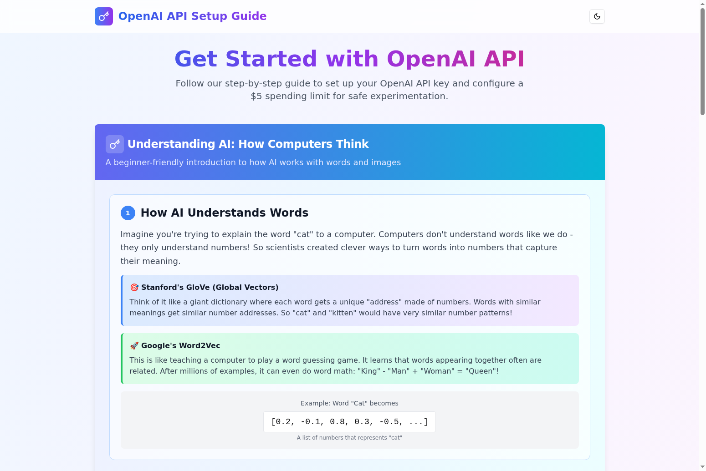

# 🎯 OpenAI API Setup Guide

**🌐 Live Demo:** [https://how-to-use-open-ai-api.vercel.app/](https://how-to-use-open-ai-api.vercel.app/)



## 🚀 Project Overview

Welcome to the **OpenAI API Setup Guide** - your comprehensive, beginner-friendly tutorial for getting started with OpenAI's powerful API! This interactive web application demystifies the process of setting up your OpenAI API key while teaching you the fundamentals of how AI actually works.

## ✨ Key Features

### 🧠 **AI Education Made Simple**
- **🔤 Word Processing Explained**: Learn how computers convert words into numbers using Stanford's GloVe and Google's Word2Vec
- **🖼️ Image Understanding**: Discover how AI "sees" images by converting pixels into numerical data
- **💡 Real-world Examples**: Interactive demonstrations showing how "cat" becomes `[0.2, -0.1, 0.8, 0.3, -0.5, ...]`

### 📋 **Step-by-Step Setup Process**
1. **🔐 Account Creation**: Direct links to OpenAI Platform with guided instructions
2. **🗝️ API Key Generation**: Secure key creation with best practices
3. **💰 Spending Limits**: Configure $5 monthly limits for safe experimentation
4. **⚡ Implementation Guide**: Environment variables and security practices

### 🎨 **Interactive User Experience**
- **🌙 Dark/Light Mode**: Toggle between themes with smooth transitions
- **📋 Copy-to-Clipboard**: One-click copying for API keys and code snippets
- **🔗 External Links**: Direct access to OpenAI documentation and resources
- **📱 Responsive Design**: Perfect on desktop, tablet, and mobile devices

### 🛡️ **Security & Best Practices**
- **⚠️ Security Warnings**: Clear guidance on API key protection
- **💸 Cost Management**: Spending limit configuration to prevent unexpected charges
- **📚 Additional Resources**: Links to official documentation, rate limits, and safety guidelines

## 🛠️ Technology Stack

- **⚛️ React 18** - Modern UI framework
- **📘 TypeScript** - Type-safe development
- **⚡ Vite** - Lightning-fast build tool
- **🎨 Tailwind CSS** - Utility-first styling
- **🧩 Radix UI** - Accessible component primitives
- **🎭 Lucide React** - Beautiful icons
- **🌈 Class Variance Authority** - Dynamic styling

## 🎯 Target Audience

Perfect for:
- **👨‍💻 Developers** new to OpenAI API
- **🎓 Students** learning about AI integration
- **🚀 Entrepreneurs** exploring AI-powered applications
- **🔬 Researchers** needing quick API setup
- **📚 Educators** teaching AI concepts

## 🌟 What Makes This Special

### 🎪 **Unique Educational Approach**
Unlike typical API documentation, this guide starts with the fundamentals - explaining how AI actually processes information before diving into implementation details.

### 🎨 **Visual Learning**
- Color-coded examples showing RGB values as numbers
- Interactive demonstrations of word-to-number conversion
- Visual representations of how images become data grids

### 🔒 **Safety First**
Emphasizes responsible AI usage with built-in spending limits and security best practices from day one.

### 🎭 **Engaging Design**
Beautiful gradients, smooth animations, and intuitive navigation make learning enjoyable rather than overwhelming.

## 🚀 Getting Started

### Prerequisites
- Node.js 18+ 
- npm or yarn

### Installation

```bash
# Clone the repository
git clone https://github.com/raimonvibe/how-to-use-open-ai-api.git

# Navigate to project directory
cd how-to-use-open-ai-api

# Install dependencies
npm install

# Start development server
npm run dev
```

Visit `http://localhost:5173` to see the application in action!

## 📦 Available Scripts

```bash
npm run dev      # Start development server
npm run build    # Build for production
npm run preview  # Preview production build
npm run lint     # Run ESLint
```

## 🤝 Contributing

Contributions are welcome! Whether it's:
- 🐛 Bug fixes
- ✨ New features
- 📝 Documentation improvements
- 🎨 UI/UX enhancements

Please feel free to open an issue or submit a pull request.

## 📄 License

This project is licensed under the MIT License - see the [LICENSE](LICENSE) file for details.

## 🌐 Connect with Raimon

- **🐦 Twitter/X**: [@raimonvibe](https://x.com/raimonvibe/)
- **📺 YouTube**: [Raimon's Channel](https://www.youtube.com/channel/UCDGDNuYb2b2Ets9CYCNVbuA/videos/)
- **📱 TikTok**: [@raimonvibe](https://www.tiktok.com/@raimonvibe/)
- **📷 Instagram**: [@raimonvibe](https://www.instagram.com/raimonvibe/)
- **✍️ Medium**: [@raimonvibe](https://medium.com/@raimonvibe/)
- **💼 LinkedIn**: [raimonvibe](https://www.linkedin.com/in/raimonvibe/)
- **🐙 GitHub**: [raimonvibe](https://github.com/raimonvibe/)

---

**🎉 Happy coding with OpenAI API!** 

*Made with ❤️ by [Raimon](https://github.com/raimonvibe) to make AI accessible to everyone.*
